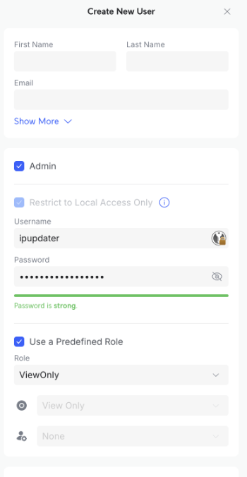

# unifi-dyndns

A minimalistic script that periodically retrieves the WAN (IPv6 or IPv4) address from a local UniFi controller (UDR, UDM, Cloud Gateway, ...) and updates the dynamic DNS record through a DNS web API.


## Prerequisites

### UniFi 
* You should create a new User with read permissions.

 
* Check which interface your WAN port uses
```bash
export UNIFI_GATEWAY_IP=10.10.10.1
export UNIFI_USERNAME=ipupdater
export UNIFI_PASSWORD=123456

curl -k -c cookies.txt -X POST https://${UNIFI_GATEWAY_IP}/api/auth/login \
  -H "Content-Type: application/json" \
  -d '{"username":"'${UNIFI_USERNAME}'","password":"'${UNIFI_PASSWORD}'"}'

curl -k -b cookies.txt https://${UNIFI_GATEWAY_IP}/api/system
```
Your WAN port information is in this block. You need this `"interface": "ethXYZ"`:
```json
  "wans": [
    {
      "interface": "eth4",
      "ipv4": "192.168.1.2",
      "ipv6": "2a01:5241:0000:0000:0000:0000:0000:0000",
      "plugged": true,
      "enabled": true,
      "type": "WAN",
      "port": 5,
      "mac": "00:00:00:00:00:00"
    }
  ],
```

### DNS Provider
You need an update API URL from your DNS provider along with credentials. I'm using Variomedia, where you can create separate credentials for the DNS update API. The Variomedia API URL is:
```
dyndns.variomedia.de/nic/update?hostname=%h&myip=%i
```
`%h` and `%i` will be replaced with the hostname and IP address. Check your provider for the correct API URL.

#### DynDNS Update URLs of popular providers

Most providers implement the [DynDNS2 protocol](https://help.dyn.com/remote-access-api/) and accept credentials via HTTP Basic Auth (`PROVIDER_USERNAME` / `PROVIDER_PASSWORD`). Exceptions are noted.

| Provider | `PROVIDER_API` value | Notes |
|---|---|---|
| [Variomedia](https://www.variomedia.de/) | `dyndns.variomedia.de/nic/update?hostname=%h&myip=%i` | |
| [No-IP](https://www.noip.com/) | `dynupdate.no-ip.com/nic/update?hostname=%h&myip=%i` | |
| [DynDNS / Oracle Dyn](https://dyn.com/) | `members.dyndns.org/nic/update?hostname=%h&myip=%i` | |
| [Hurricane Electric (HE.net)](https://dns.he.net/) | `dyn.dns.he.net/nic/update?hostname=%h&myip=%i` | Password = DDNS key set per record |
| [Dynu](https://www.dynu.com/) | `api.dynu.com/nic/update?hostname=%h&myip=%i` | |
| [Google Domains](https://domains.google/) | `domains.google.com/nic/update?hostname=%h&myip=%i` | Credentials from DDNS settings |
| [OVH DynHost](https://www.ovh.com/) | `www.ovh.com/nic/update?system=dyndns&hostname=%h&myip=%i` | |
| [STRATO](https://www.strato.de/) | `dyndns.strato.com/nic/update?hostname=%h&myip=%i` | |
| [INWX](https://www.inwx.de/) | `dyndns.inwx.com/nic/update?hostname=%h&myip=%i` | |
| [Spdyn (Selfhost.de)](https://spdyn.de/) | `update.spdyn.de/nic/update?hostname=%h&myip=%i` | |
| [YDNS](https://ydns.io/) | `ydns.io/api/v1/update/?host=%h&ip=%i` | Basic Auth: email / password |
| [nsupdate.info](https://www.nsupdate.info/) | `nsupdate.info/nic/update?hostname=%h&myip=%i` | |
| [ChangeIP](https://www.changeip.com/) | `nic.changeip.com/nic/update?hostname=%h&myip=%i` | |
| [Loopia](https://www.loopia.com/) | `dns.loopia.se/XDynDNSServer/XDynDNS.php?action=edit&host=%h&myip=%i` | |
| [Servercow](https://servercow.de/) | `dynupdate.servercow.de/nic/update?hostname=%h&myip=%i` | |
| [All-Inkl](https://all-inkl.com/) | `dyndns.kasserver.com/?myip=%i` | Hostname passed via Basic Auth username |
| [Duck DNS](https://www.duckdns.org/) | `www.duckdns.org/update?domains=%h&token=<TOKEN>&ip=%i` | No Basic Auth; set token in URL |
| [FreeDNS (afraid.org)](https://freedns.afraid.org/) | `sync.afraid.org/u/<TOKEN>/` | No Basic Auth; token-based URL |
| [IPv64.net](https://ipv64.net/) | `ipv64.net/nic/update?key=<APIKEY>&domain=%h&ip=%i` | No Basic Auth; API key in URL |
| [Namecheap](https://www.namecheap.com/) | `dynamicdns.park-your-domain.com/update?host=<HOST>&domain=<DOMAIN>&password=<PASSWORD>&ip=%i` | No Basic Auth; all params in URL |

> **Note:** For providers marked "No Basic Auth", leave `PROVIDER_USERNAME` / `PROVIDER_PASSWORD` empty and embed credentials directly in the `PROVIDER_API` URL.


## Docker usage

### Docker compose example
```
version: "3.4"
services:
  ddns-get-ip:
    image: chtake/unifi-dyndns:latest
    environment:
      - UNIFI_GATEWAY_IP=10.10.10.1
      - UNIFI_USERNAME=UNIFI_USERNAME
      - UNIFI_PASSWORD=UNIFI_PASSWORD
      - FETCH_PROTO=ipv6
      - PROVIDER_API=dyndns.variomedia.de/nic/update?hostname=%h&myip=%i
      - PROVIDER_USERNAME=domains@example.com
      - PROVIDER_PASSWORD=mypassword
      - DDNS_DOMAIN=dyn-home.example.com
      - RUN_INTERVAL_SECONDS=300
    restart: always
```
Hint: The RUN_INTERVAL_SECONDS should be greater than your DNS TTL.

## Motivation

My home ISP uses IPv4 CGNAT and IPv6. I'm using a VPN to connect from outside to my local network, but with CGNAT IPv4, a connection from the outside in isn't possible. My local network is based on the Ubiquiti UniFi system. So I decided to use the public IPv6 address as the endpoint. To get the VPN running over IPv6, you have to manually add a firewall allow rule for the WireGuard/OpenVPN port and get a DynDNS updater running.

There are several ways to update a DynDNS record with your IP.

* use the Fritz!Box (or provider router) DynDNS updater if you use "Double-NAT"
* use one of the countless Docker/Linux DynDNS scripts running on a Linux box in your local network
* use the DynDNS updater from UniFi
* maybe many more ..

The problem with the first two: These tools update the record with their own(!) IPv6 address. So the device must have an IPv6 address, and your record points after the update to this device, not to your UniFi box.
The third option is a bit tricky — UniFi doesn't allow IPv6 DynDNS updates configured through its web UI. You can add the required `allow-ipv6 = true` configuration flag via SSH, but the config file can (and will) be overwritten at any time. Another problem is that there are no logs or alerts in the UniFi UI. In the worst case, you notice that the DNS is no longer updated when you are away from home and try to connect to your VPN.

This is where this little tool comes in. The system running this tool doesn't need a configured IPv6 address — it only needs a local user account for your UniFi system and the credentials to update the record through the updater API.

## Setup

```bash
python3 -m venv .venv
source .venv/bin/activate
pip install -e .[dev]
```

## Run

```bash
python -m unifi_dyndns
```

## Tests

```bash
pytest
```
